# High-Speed Camera System
An embedded system for visualizing fast UV-triggered polymerization reactions in slow motion.

## Table of Contents
- [High-Speed Camera System](#high-speed-camera-system)
  - [Introduction](#introduction)
  - [System Architecture](#system-architecture)
  - [System Components](#system-components)
  - [Optimizing Capture Speed](#optimizing-capture-speed)
  - [Frame Processing and Output](#frame-processing-and-output)
  - [Raspiraw Command Line Options](#raspiraw-command-line-options)
  - [Customizations for HighFPS Capture](#customizations-for-High-FPS-capture)
  - [System Testing Update](#system-testing-update)
  - [Outdoor Lighting Test](#outdoor-lighting-test)
    - [Sample Captures](#sample-captures)
  - [Exhibit Testing – First On-Site Capture Attempts](#exhibit-testing--first-on-site-capture-attempts)
  - [Mouse Based Triggering of Video Capture](#mouse-based-triggering-of-video-capture)
  - [Prototype Assembly and Function](#prototype-assembly-and-function)
  - [Hardware Integration](#hardware-integration)
  - [Integrating UV Illumination into the Prototype](#integrating-UV-Illumination-into-the-prototype)
  - [Camera Synchronization Experiments](#camera-synchronization-experiments)
    - [Focus Improvement](#focus-improvement)
    - [Exposure and Gain Adjustment](#exposure-and-gain-adjustment)
  - [Fluorescent Additive and Exposure Adjustment](#fluorescent-additive-and-exposure-adjustment)
  - [Sensor Calibration Workflow](#sensor-calibration-workflow)
  - [Camera Relocation and Lens Upgrade](#camera-relocation-and-lens-upgrade)
  - [Sharpening Filter in Video Encoding](#sharpening-filter-in-video-encoding)
  - [System Setup and Environment Management](#system-setup-and-environment-management)
  - [Interactive Playback UI](#Interactive-playback-UI)
  - [Next Steps](#next-steps)
 

## Introduction 

Fast polymerization reactions triggered by UV light occur too quickly to be captured by the human eye or standard cameras.

We present a low-cost embedded system that detects the UV flash and records the reaction using high-speed imaging, enabling slow-motion playback for detailed observation and live demonstration.
## System Architecture

//to do update
1. A UV flash occurs, triggering a fast polymerization reaction.
2. An analog UV sensor detects the flash.
3. The signal is digitized by an external ADC and read by a Raspberry Pi 3.
4. Upon detection, the Raspberry Pi captures a high-speed burst of frames using the Raspberry Pi Camera Module v2.
5. Frames are buffered in RAM for fast access.
6. Playback is displayed on an HDMI screen and controlled via physical buttons (Play / Pause / Reset).
## System Components

//to do update
- **Raspberry Pi 5** – Responsible for capturing images and displaying playback.
- **Raspberry Pi Camera Module v2** – Used to record high-speed frames of the reaction.
- **GUVA-S12SD UV Sensor** – Detects the presence of UV light to signal the start of recording.
- **External ADC** – Converts the analog signal from the UV sensor to a digital format.
- **HDMI Display** – Displays the slow-motion playback of the recorded footage.
- **Physical Buttons (Play / Pause / Reset)** – Used for user interaction with playback.
  
## Optimizing Capture Speed

To successfully capture the fast polymerization reaction, the system must record a short, intense event that completes in under 100 milliseconds. Standard camera configurations are inadequate for such timing, so we needed to significantly increase the camera’s frame rate.

The Raspberry Pi Camera Module v2 uses a **rolling shutter**, meaning it reads each frame line by line (row by row) from top to bottom, rather than capturing the entire image at once. As a result, the time it takes to capture a full frame is directly proportional to the number of rows. By reducing the **vertical resolution** (height) of the image, the camera completes each frame readout more quickly allowing for much higher frame rates.

In our configuration, we reduced the image height to only 64 rows using the `-h 64` flag. This trade-off results in a narrow horizontal viewing band, but enables the camera to reach approximately 975 frames per second when combined with increased analog gain and optimized sensor parameters. Reducing the **width** of the image, on the other hand, has negligible impact on performance, since each row is still read as a unit. Therefore, vertical reduction is the most effective method for achieving high-speed capture with this sensor.

The resulting frames were buffered in RAM to ensure minimal write delays, and later processed into a slow-motion video using precise timing information for synchronization.

---

## Frame Processing and Output

We used the open-source `raspiraw` tool to capture raw Bayer-format frames directly from the Raspberry Pi Camera Module v2. Captured frames were converted to `.tiff` format using `dcraw`, and then compiled into a synchronized slow-motion video using `ffmpeg`, referencing the original timestamps.

This pipeline allowed us to reconstruct the short, high-speed event into a temporally stretched video that reveals details not visible at normal playback speeds.

Currently, the recorded frames appear dark due to limited lighting during initial testing. We are experimenting with improved lighting conditions, but expect that the final exhibit setup, which includes a strong UV flash during the reaction, will provide sufficient illumination without the need for supplemental light sources. If needed, we have the option to integrate additional lighting into the exhibit to ensure consistent visibility and recording quality.

---
## **Raspiraw Command Line Options**

Based on the [raspiraw GitHub repo, deprecated, kept for reference](https://github.com/6by9/raspiraw).
This is a clarified summary we prepared for our project README.

### **Base Options**

| Flag             | Description                                                                                  |
|------------------|----------------------------------------------------------------------------------------------|
| `-?`, `--help`   | Show help information.                                                                       |
| `-md`, `--mode`  | Select predefined sensor mode (1–7). Example: `-md 7` = VGA high-FPS mode (640×480).         |
| `-hf`, `--hflip` | Apply horizontal flip.                                                                       |
| `-vf`, `--vflip` | Apply vertical flip.                                                                         |
| `-e`, `--ss`     | Set exposure time in uncalibrated units (legacy).                                            |
| `-eus`, `--expus`| Set exposure time in microseconds (recommended). Example: `-eus 200` = 200 µs exposure.      |
| `-g`, `--gain`   | Set sensor gain (uncalibrated register code). Keep low (≈1) to reduce noise with strong light.|
| `-c`, `--cameranum` | Select camera connector: 0 = CAM0, 1 = CAM1.                                              |
| `-y`, `--i2c`    | Select I2C bus (0–2). Normally leave at default.                                             |

### **Output Settings**

| Flag               | Description                                                                                                  |
|--------------------|--------------------------------------------------------------------------------------------------------------|
| `-o`, `--output`   | Output file(s). Use printf style formatting: `/dev/shm/out.%04d.raw` → out.0001.raw, out.0002.raw …           |
| `-hd`, `--header`  | Write 32 KB BRCM header to every frame (needed by dcraw, but too heavy at high FPS).                         |
| `-hd0`, `--header0`| Write header once to a separate file (e.g. `hd0.32k`). Later concatenate: `cat hd0.32k frame.raw > out.raw`. |
| `-ts`, `--tstamps` | Write timestamps to file in CSV format: `delta,index,timestamp`. Useful for FPS verification and drops.       |
| `-emp`, `--empty`  | Write empty files only. Used to measure maximum callback rate (upper FPS bound) without I/O bottlenecks.      |

### **Timing & Frame Rate**

| Flag             | Description                                                                                  |
|------------------|----------------------------------------------------------------------------------------------|
| `-t`, `--timeout`| Capture duration in ms (default 5000). Example: `-t 100` = capture 100 ms.                   |
| `-sr`, `--saverate` | Save every Nth frame. Default = 20. Use `-sr 1` to save all frames (RAM disk required).   |
| `-f`, `--fps`    | Request target FPS (float). Adjusts frame/line length registers. Actual FPS depends on ROI.  |

### **ROI (Region of Interest)**

| Flag              | Description                                                                                 |
|-------------------|---------------------------------------------------------------------------------------------|
| `-w`, `--width`   | ROI width (columns). Reduces horizontal size and output data.                               |
| `-h`, `--height`  | ROI height (rows). Critical for high FPS: fewer rows → shorter frame time → higher FPS.      |
| `-tp`, `--top`    | Top offset of ROI. Defines which rows are captured. Example: `-tp 1200 -h 64` → 64 rows near middle. |

### **Sub Sampling**

| Flag              | Description                                                                                 |
|-------------------|---------------------------------------------------------------------------------------------|
| `-hi`, `--hinc`   | Horizontal increment (reg 0x3814). Skips pixels horizontally. Example: `-hi 11` = read all, larger values skip pixels. |
| `-vi`, `--vinc`   | Vertical increment (reg 0x3815). Skips rows vertically. Example: `-vi 11` = read all, `-vi 22` ≈ every 2nd row. |

Skipping rows/columns increases FPS but reduces effective resolution and may cause aliasing. We prefer reducing --height first, then apply increments if needed.

### **Direct Register Access**

| Flag             | Description                                                                                 |
|------------------|---------------------------------------------------------------------------------------------|
| `-r`, `--regs`   | Directly modify sensor registers in current mode. Format: `"ADDR,VAL;ADDR,VAL..."`.          |
|                  | Example: `-r "380A,003C;3802,78;3806,05FB"`                                                 |
|                  | Use with caution. Only registers defined in selected mode are valid.                      |

## Customizations for High FPS Capture ##

After cloning the public raspiraw repository, we realized the stock capture flow wasn’t aligned with our project goals. To reduce complexity early and keep the codebase focused on high FPS work with our specific hardware, we started in raspiraw.c, which centralizes sensor defaults and registration. Our immediate objective was to a. target a single sensor the IMX219 and b. set a sane default for the camera control bus so command line friction stays low.

We pinned DEFAULT_I2C_DEVICE to 0 and removed all non IMX219 entries, leaving:

```c
const struct sensor_def *sensors[] = {
    &imx219,
    NULL
};
```

We set DEFAULT_I2C_DEVICE to 0 and limited sensors[] to IMX219 to keep the codebase focused and deterministic for our hardware RPi 3 + IMX219. On Raspberry Pi 3, the camera control channel uses the VideoCore camera I2C, typically exposed as /dev/i2c-0 when dtparam=i2c_vc=on is enabled, defaulting to bus [0] avoids accidental probing on the general purpose /dev/i2c-1. Removing other sensors does not improve fps [fps] by itself, it reduces surface area, makes the code easier to reason about, and lets us tailor the existing path to exactly what this project needs.

Next, we attempted to reduce the ROI with -w and -h as detailed in the command table above but raspiraw aborted with:

```bash
This sensor does not currently support manual cropping settings. Aborting
```

Because the message is sensor scoped (“This sensor…”), we suspected that other sensors expose a crop path that IMX219 is missing. We opened a side by side diff to compare a known working sensor with IMX219:

```bash
code --diff original-raspiraw/ov5647_modes.h original-raspiraw/imx219_modes.h
```

In VS Code it was immediately visible that OV5647 includes a set_crop(...) that writes ROI (width, height, and other) into sensor registers, while IMX219 has no such handler.

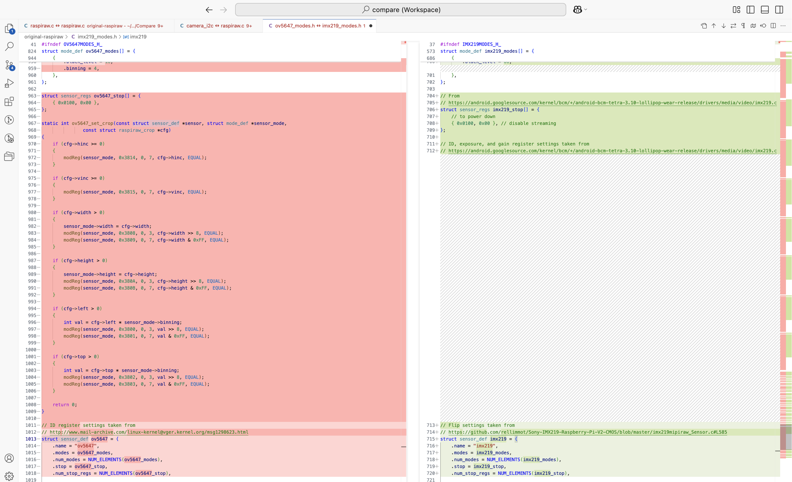  

OV5647 also wires the handler inside its sensor descriptor, this is what makes raspiraw accept -w or -h for that sensor:

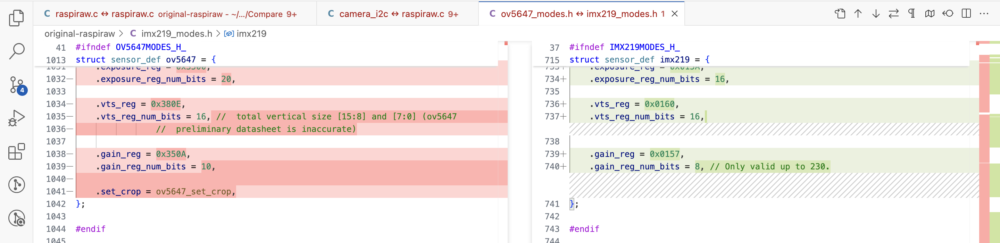  

To add the same capability for IMX219, we mapped raspiraw’s ROI flags to the IMX219 registers that control output image size. From the imx219 datasheet (picture below), the ROI size is formed by 12 bit values split across MSB/LSB register pairs:

x_output_size: 0x016C (MSB bits 11:8) + 0x016D (LSB bits 7:0)  
y_output_size: 0x016E (MSB bits 11:8) + 0x016F (LSB bits 7:0) 


*From imx219 datasheet*  
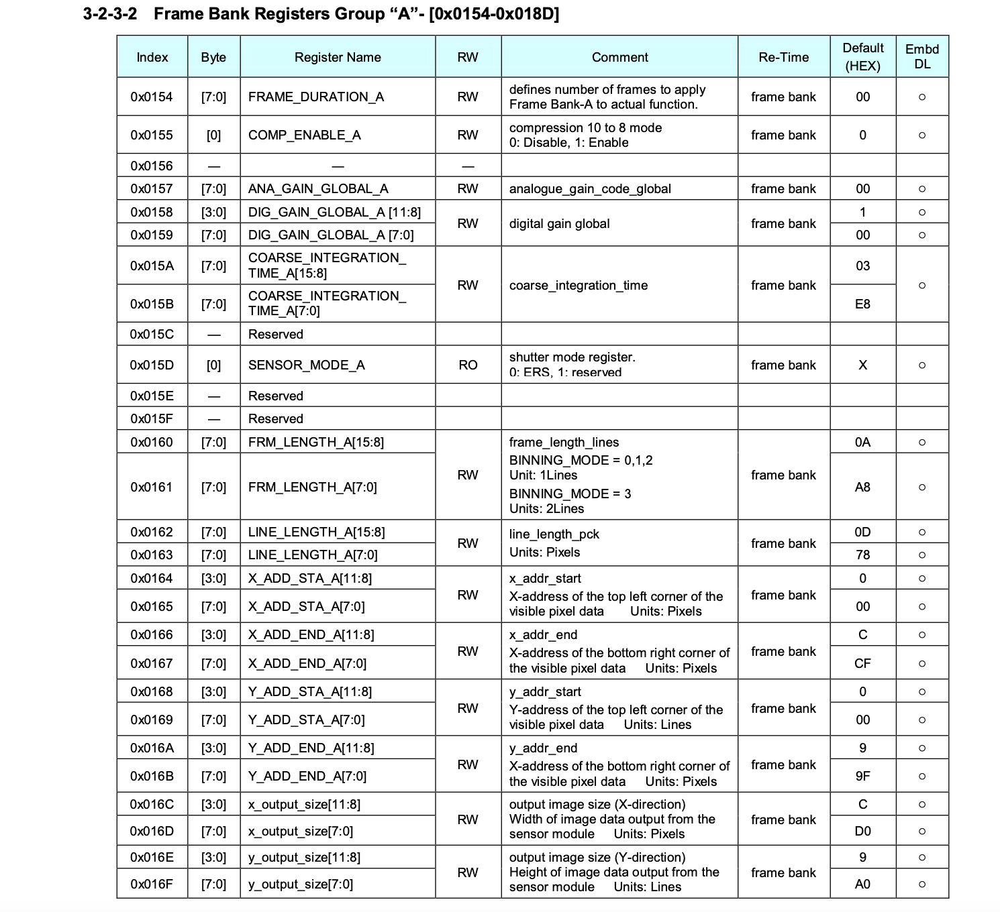  

We then added a lightweight imx219_set_crop(...) in imx219_modes.h that validates requested width / height against the current mode and writes 0x016C..0x016F. Finally, we connected the handler so raspiraw actually calls it:

```c
// Map ROI width / height to IMX219 output size registers
int imx219_set_crop(const struct sensor_def *sensor, struct mode_def *mode, const struct raspiraw_crop *cfg) {
    if( cfg->width >0){
        mode->width = cfg->width;
        modReg(mode, 0x016C , 0, 3, cfg->width >> 8, EQUAL);
        modReg(mode, 0x016D, 0, 7, cfg->width & 0xFF, EQUAL);
    }
    if( cfg->height >0){
        mode->height = cfg->height;
        modReg(mode, 0x016E , 0, 3, cfg->height >> 8, EQUAL);
        modReg(mode, 0x016F + 1, 0, 7, cfg->height & 0xFF, EQUAL);
    }
 return 0;
}

// rest of the code did not change


// in struct sensor_def imx219 we add:
.set_crop = imx219_set_crop,
```

Capture no longer aborted, but the image remained unclear and only 6 frames were saved in 1 s at a requested 30 fps. We attributed this to startup/preview plumbing that masked the expected ROI driven gain, so we pruned heavy/unused paths and, as part of that cleanup, made the scope explicit: raspiraw was capture only, emitting Bayer RAW10/RAW12 to disk, while playback/debayering ran post capture via a small Python/OpenCV script to the HDMI display.

We reviewed the CLI command enum in raspiraw.c and pruned GUI/ YUV/ auxiliary controls that do not contribute to our raw high FPS IMX219 capture path, then intentionally left the parser references in place so the compiler would surface all dependent code for removal. The red block in the VS Code diff below shows the exact enum constants deleted:

*Pruned CLI enum in raspiraw.c (left: original, right: ours)*  
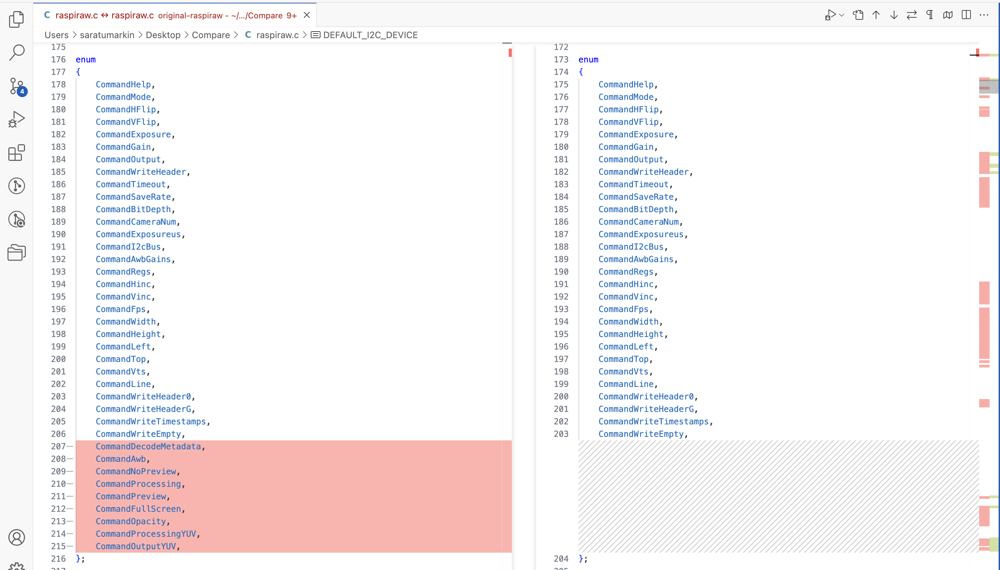

Each removed command was non essential for our architecture and would have kept unused threads, state, or I/O paths alive:

1. CommandDecodeMetadata: "Decode register metadata" (from the documentation in the file), we store Bayer RAW only and avoid in capture metadata parsing to keep CPU/I/O overhead minimal.
2. CommandAwb: "Use a simple grey-world AWB algorithm", AWB is a post demosaic operation, so we keep sensor native RAW untouched during capture.
3. CommandNoPreview / CommandPreview: “Do not send the stream to the display” / “Preview window settings <'x,y,w,h'>”, both toggled MMAL preview setup. Our node ran headless, so preview init/teardown, window geometry parsing, and GPU buffers only expanded latency and error surfaces.
4. CommandFullScreen: “Fullscreen preview mode”, another GUI refinement on the same preview path, unnecessary without a display.
5. CommandOpacity: “Preview window opacity [0–255]”, a GUI only control that provided no value for headless capture.
7. CommandProcessing: “Pass images into an image processing function”, it diverted frames into an in process pipeline, increasing queueing and cache traffic. We kept acquisition deterministic by isolating capture from processing.
8. CommandProcessingYUV: “Pass processed YUV images into an image processing function”, it assumed a color converted path we did not produce and would have forced extra buffers and conditionals.
9. CommandOutputYUV: “Set the output filename for YUV data”, our recorder persisted RAW10/RAW12 only to retain bit depth and the Bayer mosaic. A YUV sink implied real time convert/demosaic to 8-bit with chroma subsampling, adding CPU/I/O and destroying per photosite structure.

This targeted enum pruning made all transitive references (switch cases, command tables, state fields) fail to compile by design, giving us a precise to do map for deleting dead code next while keeping only ROI/I2C/RAW essentials.

After pruning the enum, we removed the same commands from cmdline_commands[] and deleted the corresponding preview/processing/YUV fields from struct raspiraw_params.

*Pruned cmdline_commands (left: original, right: ours)*  
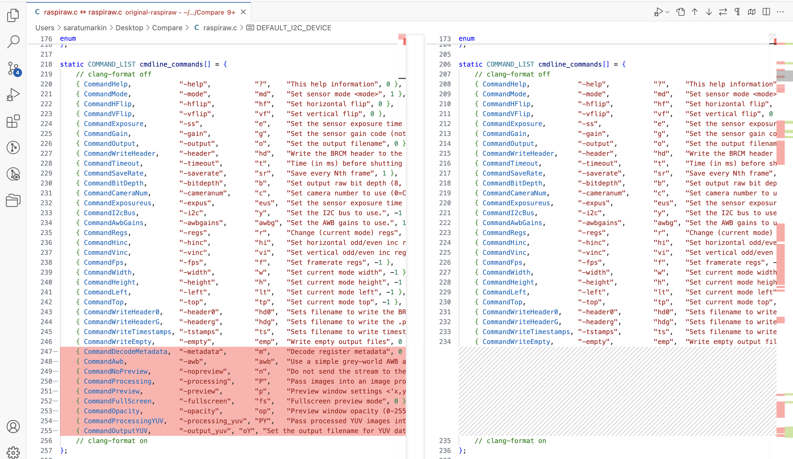

*raspiraw_params (left: original, right: ours)*  
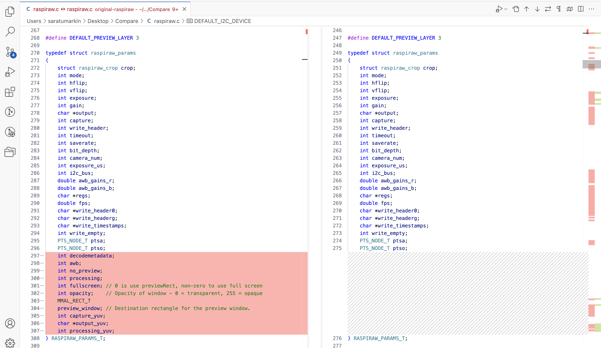

After removing the CLI commands and state flags, we aligned the runtime callback structs with the same capture only scope. In RASPIRAW_CALLBACK_T we deleted the AWB/processing fields (awb_queue, awb_thread_quit, wb_gains, processing_queue, processing_thread_quit), in RASPIRAW_ISP_CALLBACK_T we removed the YUV/extra-ISP fields (xvr_ip_pool, xvr_ip, processing_yuv_queue, processing_yuv_thread_quit). These fields belonged to the grey-world AWB path, the generic in process image processing path, and the YUV/ISP branch, none of which we use. Dropping them prevents those worker threads/queues from being created, reduces init/teardown and locking overhead, and forces any leftover references to fail at compile time.

*RASPIRAW_CALLBACK_T and  RASPIRAW_ISP_CALLBACK_T (left: original, right: ours)*  
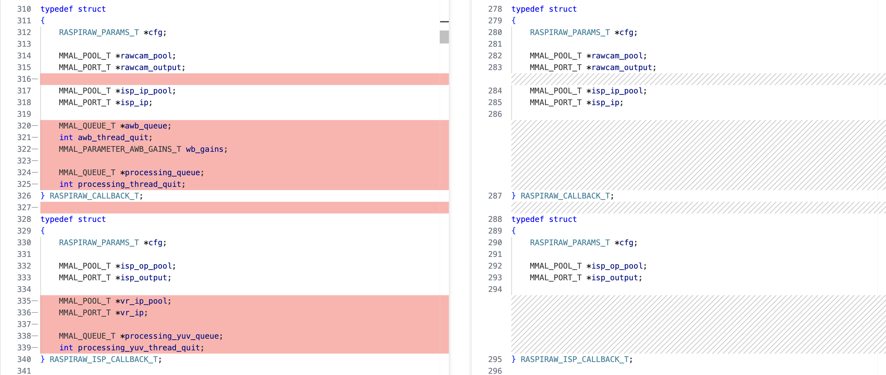


## System Testing Update ##

To evaluate the high speed capture pipeline before testing the actual polymerization reaction, we conducted a preliminary run using a simple scene: a rotating fan under dim indoor lighting.

**[View sample capture](https://drive.google.com/file/d/1PzW4zkaScqAXy1D3jOnbjnEaSPEWVI3p/view)**

This recording confirms that the system can detect and respond to visual motion and brief light changes, even under minimal illumination. Although the frames appear dark, the capture timing and buffering logic performed as expected.

---

## Outdoor Lighting Test

To verify that the camera performs well under stronger lighting conditions, we conducted an outdoor test using daylight and a stream of water as the subject. The goal was to ensure that the system reliably captures fast motion when sufficient illumination is available.

This test reused the same optimized capture configuration, with a vertical resolution of 64 rows and a frame rate of approximately 975 fps. Due to the limited frame height, the visible portion of the scene is reduced to a narrow horizontal band, requiring careful alignment of the subject within this region. In this case, the camera was sometimes rotated or inverted to better align the subject vertically within the reduced frame.

### Sample Captures

1. **[Sample 1 – Stream falling vertically](https://drive.google.com/file/d/1tkDQBM2TiiqNo0x5NmPXNWECEWIrQ5F-/view)**  
   The water stream is clearly visible as droplets fall, although the image appears upside down due to the camera being physically inverted. Despite this, the capture demonstrates that the system successfully records fast vertical motion within the limited frame height.

2. **[Sample 2 – Droplets hitting the ground](https://drive.google.com/file/d/1HDNrdlW91r2VxZYlnDlstKxNU1lgPaSQ/view)**  
   After correcting the camera orientation, the main water stream was missed due to imperfect horizontal alignment within the reduced frame height. However, droplets that rebounded off the ground were still captured, demonstrating motion detection near the frame edges.

3. **[Sample 3 – Less successful attempt](https://drive.google.com/file/d/1XEx5hrPEJuywzcE6ZUDVG6fwlSdQVgLJ/view)**  
   This capture was less successful, but still verifies the system’s ability to detect and record motion. At this stage, we chose not to further fine-tune alignment, as the results were sufficient to validate the functionality ahead of exhibit-specific testing.

---

## Exhibit Testing – First On-Site Capture Attempts

After validating the system under outdoor conditions, we conducted the first test on the actual exhibit. The goals of this session were to evaluate whether the built-in UV flash provides sufficient illumination, determine an initial camera position that captures the polymerization droplet clearly, and select a frame rate that balances motion resolution and recording duration.


**Preliminary attempt – Width 480 (failed)**  
We initially attempted to capture at width 480 and height 64 for 2 seconds at 660 fps  
The system returned a memory overflow error, likely due to buffer limitations at this width and frame rate combination  
No video was recorded  

**Attempt 1 – 'first_angle' [video link](https://drive.google.com/file/d/1XnBNxm8tU3VQpRA91qte8zRlW4S25yey/view?usp=sharing)**  
Camera placed behind the exhibit at very short distance  
Height 64, width 320, 660 fps, duration 1.5 seconds  
Result: extreme overexposure due to UV flash  
Saturation begins around 0.05 seconds and persists for ~5 seconds, obscuring the droplet completely  

**Attempt 2 – 'second_angle' [video link](https://drive.google.com/file/d/1Hyd2K05YBTS2U5h5Ollt0MIzkuETlodg/view?usp=drive_link)**  
Camera repositioned to doorway, approximately 0.5 meters from the exhibit  
Same resolution and duration as above  
The UV flash still causes significant overexposure around 0.20 seconds  
Droplet motion is not clearly visible  

**Attempt 3 – 'position_cam' [video link](https://drive.google.com/file/d/1Hyd2K05YBTS2U5h5Ollt0MIzkuETlodg/view?usp=drive_link)**  
Switched to 90 fps to help determine spatial framing  
The droplet is partially visible and suggests the need to shift the camera slightly to the left and downward  

**Attempt 4 – 'position_cam_2ndTry' [video link](https://drive.google.com/file/d/1h7z4Tb6kj34zj2ObndDjuNtJaOW4lgTu/view?usp=drive_link)**  
Adjustment made based on previous framing  
Droplet visibility improved, but further refinement is needed  

**Attempt 5 – 'position_cam_3rdTry' [video link](https://drive.google.com/file/d/1QLZG5moAc6I2PqqHCZD2S2QvedE6nByG/view?usp=drive_link)**  
Minor additional adjustments  
Closer to correct framing but still slightly misaligned  

**'heigh-64--fps-660' [video link](https://drive.google.com/file/d/1kSxTVTmyV0xH4dVVgWqpBf7O7T3rRGqm/view?usp=drive_link)**  
Camera placement appears to be close to optimal  
Droplet is more consistently visible and the UV flash no longer overwhelms the image  
This test served as a reference point for further adjustments 

**Final test of the day – 'high-fps-final' [video link](https://drive.google.com/file/d/1PDiuaL70WirRHc-hoIIKpiJEuty05d2K/view?usp=drive_link)**  
Same camera position as in the 660 fps test, but captured at 1000 fps to improve temporal resolution  
Motion appears significantly smoother, with the droplet becoming visible around 0.07 seconds  
Compared to the 660 fps version, this recording shows less choppiness and better continuity of motion.

---

## **Mouse Based Triggering of Video Capture**

After validating the high-speed capture pipeline and obtaining promising initial results, we added functionality to trigger the recording process via a mouse click. This change streamlines operation and makes the system more suitable for interactive use during testing and future exhibit deployment.

To implement this, we connected a USB mouse to the Raspberry Pi 3 and installed the necessary dependencies using apt, including evtest, python3-evdev, and ffmpeg. We then used the ls /dev/input/by-id/ command to identify the device name associated with the mouse, and confirmed the specific event path was event1. We verified this using the evtest command, which displayed real-time input events. For example, when pressing the right mouse button, we observed:

Event: time 1753012817.775234, type 4 (EV_MSC), code 4 (MSC_SCAN), value 9000  
Event: time 1753012817.775234, type 1 (EV_KEY), code 273 (BTN_RIGHT), value 1  
Event: time 1753012817.775234, type 0 (EV_SYN), code 0 (SYN_REPORT), value 0  

Based on this, we wrote a Python script named mouse_trigger.py that listens for right or middle click events and launches the video capture pipeline accordingly. We made the script executable using chmod +x mouse_trigger.py, tested it with sudo ./mouse_trigger.py, and verified that it successfully triggers the recording process when the mouse is clicked. While we intend to eventually configure the script to run automatically on boot using systemd, we have postponed this step for now in order to focus on other development priorities. The script is included in the scripts/ directory of this repository.

---

## Prototype Assembly and Function


At this stage of the project, our objective is to make the exhibit prototype fully operational so that we can integrate our high speed camera system onto it for testing and further development. Using the prototype allows us to perform controlled experiments, evaluate camera performance under realistic operating conditions, and refine both hardware and software before integrating the finalized camera into the actual museum exhibit.

The following images, taken from the museum’s official documentation, show the main components of the exhibit prototype and illustrate its operating sequence.

When the exhibit is activated, a droplet of photopolymer material is released from the liquid container by the stepper motor and peristaltic pump mechanism. As the droplet passes through the optical sensor, the sensor detects it and immediately triggers the UV curing lights. When the droplet enters the illuminated area, the polymerization process begins, solidifying the droplet in real time.

*Upper section, Liquid container and droplet dispensing mechanism*  
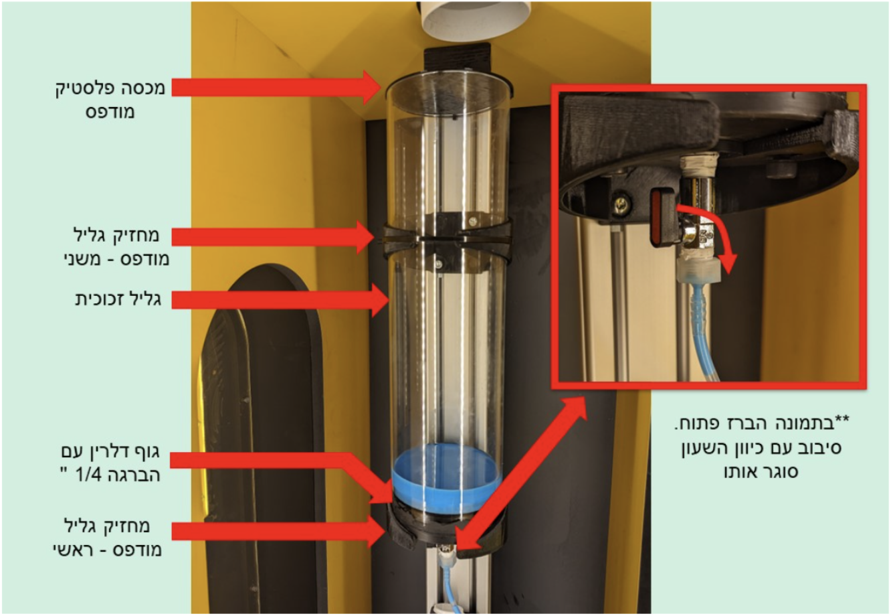  

*Central section, Optical sensor, UV LED curing module, and stepper motor mechanism*  
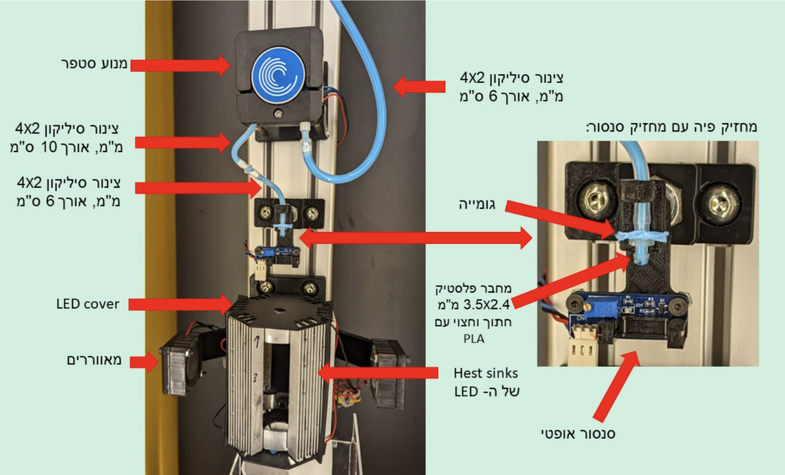  

*Bottom section of the exhibit, Collection base and guiding elements*  
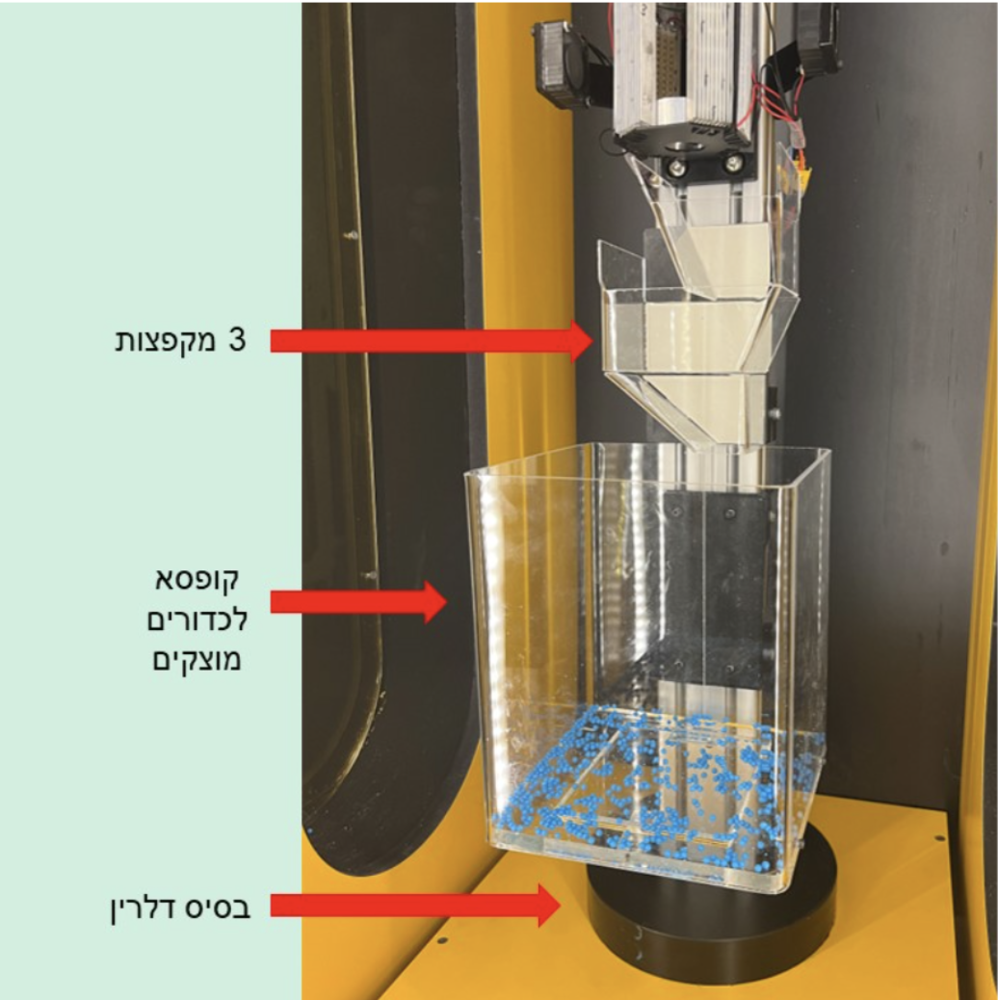  

The system consists of four main subsystems, described below in the logical order of operation:

1. **Stepper Motor and Peristaltic Pump**
   
   The droplet dispensing mechanism is powered by a bipolar stepper motor coupled to a peristaltic pump. This setup ensures precise droplet volume control and consistent release intervals, both of which are essential for accurate triggering and curing.  

   The stepper motor is driven by a dedicated driver controlled by the shield, allowing firmware based adjustments to speed and timing. Mechanical alignment of the nozzle relative to the detection beam is critical, even small deviations can affect detection accuracy.


2. **Drop Detection System**  
    
   Once the droplet is released, it passes through a custom built optical sensor designed and assembled in house at the museum. Based on the provided schematic, it uses a dedicated light source and photodetector arranged so that a passing droplet partially blocks or scatters the beam. This causes a measurable change in sensor output, processed by conditioning electronics to filter noise, stabilize the signal, and generate a clean digital trigger.  

   The detection module is implemented on a compact, project specific PCB that includes the photodetector, connectors, and all required passive components for stable and repeatable operation. It interfaces directly with the control shield for real time triggering of the curing light.  

   *Schematic, Drop Sensor*  
   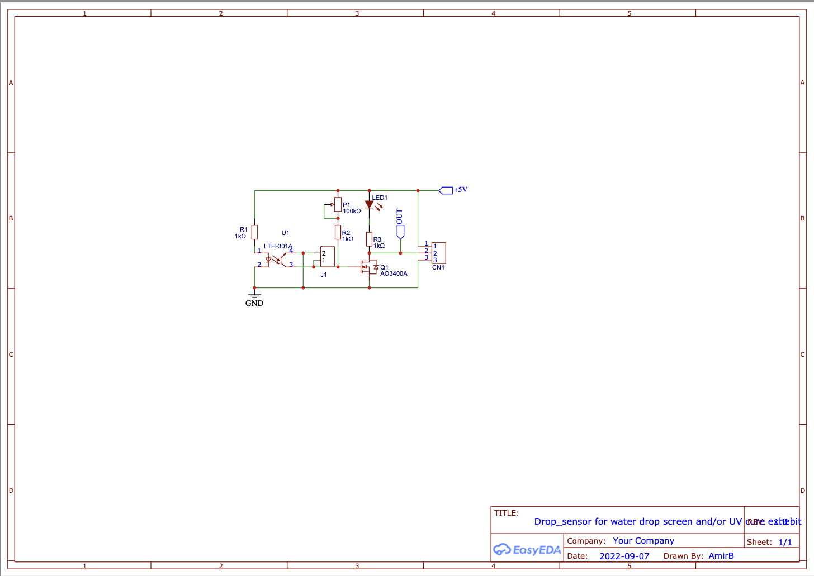  

   *PCB Layout, Drop Sensor*  
     


3. **Control and Integration Shield**  
    
   Acting as the central hub, the custom control shield mounted on an Arduino based microcontroller manages all electrical connections, signal routing, and power distribution.  

   It receives the trigger from the detection system, sends activation signals to the UV curing light, and controls the stepper motor driver for droplet dispensing. During testing, it also allows flexible reconfiguration of timing parameters and operational modes.  

   *Schematic, Control Shield*  
   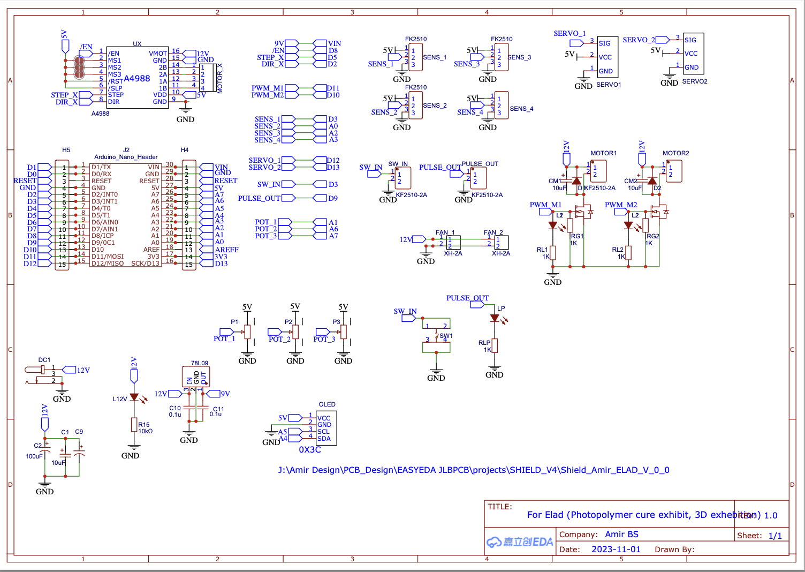  

   *PCB Layout, Control Shield*  
   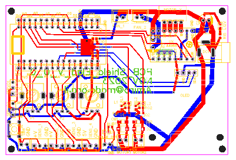  

   Electronic dashboard of the control system, This panel contains all the necessary connections for the stepper motor, UV LEDs, sensor, and control buttons, as well as potentiometers for setting drop number, drop rate, and curing time. The OLED display provides real time status information, enabling quick configuration during tests.  
   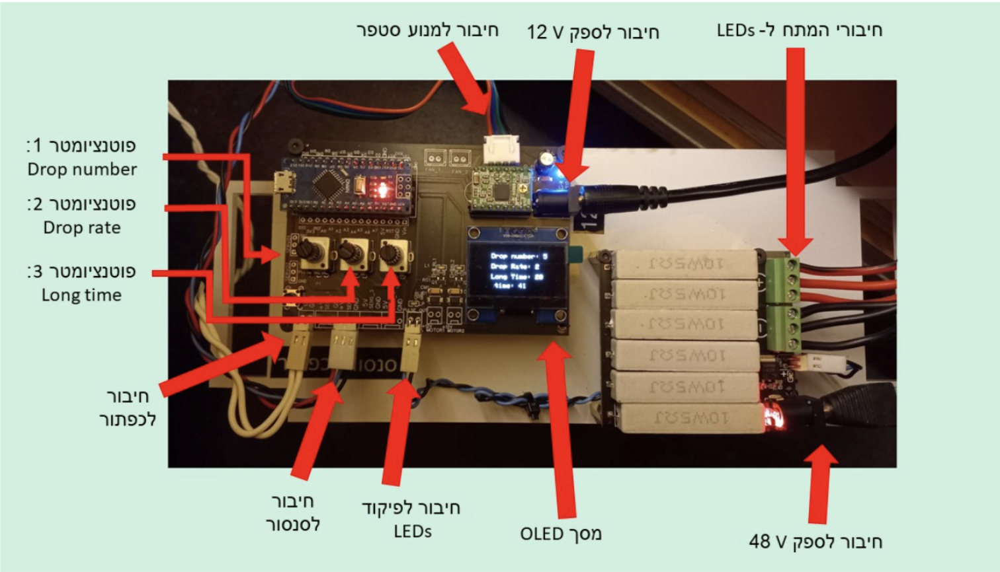  


4. **UV Curing Light System**  
    
   Triggered by the control shield, the UV curing subsystem consists of a custom high power UV LED module, also designed and assembled in house. The LED array is driven by a dedicated circuit that provides stable current and precise timing control.  

   The curing wavelength is matched to the photopolymer’s requirements to ensure rapid solidification. Pulse duration is tightly controlled, too short results in incomplete curing, while too long could negatively affect visual quality.  

   *Schematic, UV Curing Light*  
   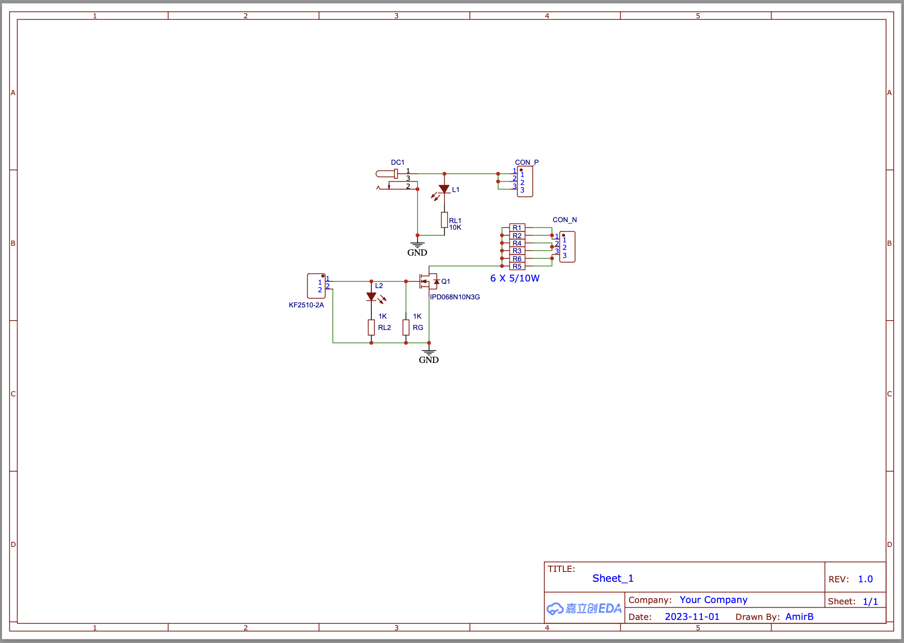  

   *PCB Layout, UV Curing Light*  
     


## **Hardware Integration**

Before we could begin developing our control logic for the exhibit’s prototype, we first needed to familiarize ourselves with working on the Arduino platform. After several unsuccessful attempts to upload our first test sketch, we discovered that the issue was not with the code itself, but with the configuration in the Arduino IDE. The Board, Processor, and Port settings had to match our actual hardware in order for uploads to succeed. Once we selected:

Board: Arduino Nano

Processor: ATmega328P

Port: /dev/cu.usbserial-10

compilation and uploading worked perfectly, allowing us to proceed.

Our first task was to run a basic LED blink test to confirm that our environment was set up correctly and that we could upload and execute code. The test simply turned the onboard LED on for one second, then off for one second, while printing the LED state to the Serial Monitor.

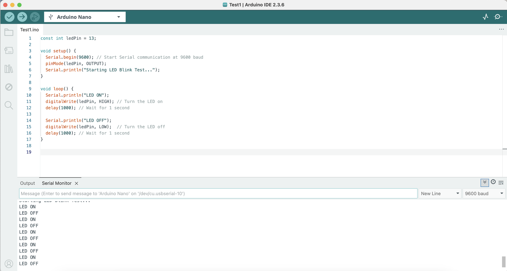  

Once compiled and uploaded, the board responded exactly as intended, the LED pulsed at one second intervals, and the Serial Monitor displayed the corresponding messages. This confirmed that our development environment was correctly configured and that we could reliably program and communicate with the microcontroller.

With the basics in place, we moved on to the prototype hardware. We took the custom PCB designed for the exhibit and began learning soldering techniques so that we could mount the Arduino, the stepper motor driver, and the necessary connectors for both the optical drop sensor and the stepper motor. After the components were soldered and visually inspected for proper joints and alignment, we connected the key wires according to the schematic. At this stage, we decided not to connect the UV LED array we leave that part of the system offline until later in the integration process.

In the original version of the exhibit’s code, operation relied on physical controls: a start push button connected to pin D3 and three potentiometers used to set the number of drops, the interval between drops, and the long cycle timing. While these controls are suitable for a final museum installation, they were not convenient for our development workflow. Adjusting hardware knobs and pressing buttons on the exhibit each time we needed to change parameters or start a test would have slowed down our iteration process. We also wanted the ability to log and adjust settings directly from the development machine while monitoring the system’s state in real time.

To address this, we modified the final exhibit code to replace the physical interface with a serial command interface. We implemented a simple text based protocol in which typing go into the Serial Monitor sets an internal active flag and starts the motor routine to dispense drops:

if (command == "go") {  
    active_flag = true;  
    move_motor(true);  
}

Typing stop halts all motion and processes:

if (command == "stop") {  
    active_flag = false;  
    move_motor(false);  
}

Additional commands such as help display the available commands, and status prints the current system state, including drop count, active status, and sensor readings. We also introduced a family of set commands to replace the potentiometers, allowing us to directly assign parameters like the number of drops per run, the time between drops, suspension and exposure times, and stepper speed. For example:

set drnum 15  // sets drops per run to 15  
set drprt 3   // sets seconds between drops to 3  

These parameters are stored in variables already defined in the project’s header files, making them immediately usable by the existing control logic.

This serial based control method proved invaluable for prototype testing. It enabled us to quickly iterate on settings without touching the hardware, maintain precise control over the sequence of events, and focus entirely on verifying motor motion, drop detection, and system responsiveness. With these modifications in place, we had a stable and flexible foundation for integrating the high speed camera, confident that we could trigger and monitor the drop process entirely from the development environment.

After finalizing the updated code and successfully uploading it to the Arduino, we were ready to test the prototype in real conditions. When we first powered the system, a few drops of photopolymer material fell through the nozzle, leftovers that had been sitting in the tubing for nearly two years. Once that residual material was depleted, the chemical reaction that normally hardens the drops was no longer relevant for our current stage, since our focus at this point was on the camera integration rather than the curing process. To keep testing, we decided to replace the photopolymer with water.

After switching to water, the droplet dispensing mechanism stopped functioning entirely. Initially, we suspected an electrical issue and tested various components, but all were working as expected. We then turned to the software, modifying and testing the code, yet the problem persisted. The mechanism simply would not advance, leading us to suspect a mechanical fault or an unexpected interaction between the water and the system’s components.

Eventually, we decided that we needed to look inside the exhibit itself to get to the root of the problem. Disassembling the system revealed the true cause: a small amount of photopolymer residue had remained inside the nozzle and tubing. When we introduced water, the residual polymer reacted, triggering partial polymerization inside the narrow outlet path. Over time this reaction produced a hardened blockage that completely sealed the nozzle.

With the cause identified, the fix was straightforward. We replaced the liquid container, thoroughly cleaned the nozzle, and ensured that no hardened residue remained. Once reassembled, the system returned to normal operation, dispensing clean, consistent drops once again.

With the droplet mechanism restored, we turned our attention to the next milestone synchronizing the operation of the exhibit with the triggering of the high speed camera. We considered two possible approaches:

1. Connect to the exhibit’s start button, then apply a fixed delay (determined experimentally) before initiating camera capture.
2. Tap into the existing optical sensor, using its detection signal to trigger the camera precisely at the moment a droplet passes through.

After weighing the options, we chose the second method. It offered greater timing accuracy, ensured perfect alignment between droplet detection and camera recording, and required minimal additional hardware, as the sensor was already integrated into the exhibit’s control system.

Since the UV LEDs and OLED display were not yet connected, we had no visual confirmation that the optical drop sensor was functioning. To create a temporary diagnostic method, we modified the code so that specific pins would output a high signal whenever the sensor output went low, which should occur when a droplet passes through and blocks the beam, pulling the sensor line to 0. In the original code, the sensor input pin was defined as:

#define SENSOR_IN (A0)

We kept the same input pin but added logic to mirror its state to another output pin for monitoring. This way, if the sensor detected a drop, the output pin could be probed or connected to an external LED for immediate feedback.

Initially, we tried reading and printing the sensor values directly to the Serial Monitor before wiring everything into the system, but no readings appeared. This led us to suspect that the sensor might be faulty. We knew from documentation that a functional sensor should illuminate its onboard LED when detecting an object, but in our case, no LED lit up. We wondered if the sensor simply couldn’t detect water, but even when we placed a finger in the beam, nothing happened.

Convinced the sensor might be defective, we removed it from the system and connected it to a benchtop power supply. When powered this way, passing a hand through the beam triggered the onboard LED. However, once reinstalled in the exhibit, it again failed to detect anything. Closer inspection revealed the root cause: the wiring in the exhibit had been reversed. The wire meant for ground was connected to the positive supply, and the positive lead was connected to ground. This wiring error effectively prevented the sensor from operating at all.

We disassembled the relevant section of the wiring, corrected the connections, and tested again. With the wiring fixed, the sensor reliably triggered when a hand passed through the beam. Unfortunately, when we powered on the exhibit and tested with water drops, it still did not detect them. Even after coloring the water to increase contrast, there was no detection. We then realized that the sensor’s detection zone was physically narrow, if the droplet didn’t pass exactly through this beam path, it wouldn’t register. After carefully adjusting the droplet’s alignment so it passed directly through the beam’s center, the sensor successfully triggered, confirming our suspicion and restoring its functionality.

With the sensor now operating correctly, our next objective was to connect the Arduino to the Raspberry Pi so the Pi could receive a trigger signal each time a drop was detected. This would allow the Pi to start high speed video capture in perfect synchronization with the event. On the PCB, the drop sensor’s output is labeled SENSE2, but for the Pi connection we selected the unused SENSE4 interface to avoid interfering with the existing exhibit circuitry. On the Arduino side, pin A3 was connected to pin 2 of SENSE4, with pin 3 serving as ground and pin 1 (Vin) left unconnected. The Arduino’s ground and the Raspberry Pi’s ground were also tied together to ensure a common reference.

In the firmware, A3 was configured as an OUTPUT during setup(). The logic was updated so that whenever the sensor reading met the detection condition (SENSOR_IN <= sensor_threshold), the Arduino drove A3 HIGH, sending the trigger pulse to the Pi. Once the detection and curing process was complete, the pin was set back to LOW. This ensured that the Pi would only receive a single, clean pulse per detected drop, eliminating any chance of false triggers.

Because the Arduino operates at 5 V logic and the Raspberry Pi GPIO pins are limited to 3.3 V, we needed a safe way to reduce the voltage before sending it to the Pi. We built a passive voltage divider using resistors to bring the signal down to approximately 3.2 V. The divider was constructed from three 1 kΩ resistors, with two of them connected in series to form the equivalent of a 2 kΩ resistor. This arrangement provided the desired ratio and allowed us to connect the Arduino output safely to the Pi.

The schematic of the voltage divider is shown below:

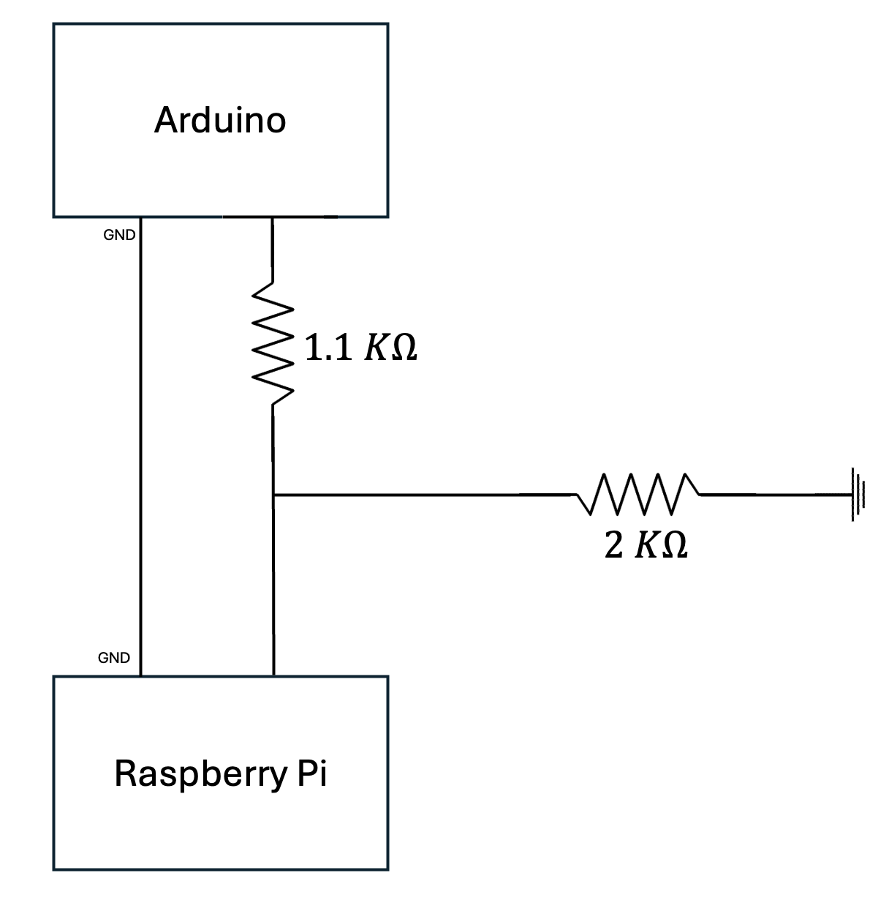

In theory, we selected standard resistor values of 1.1 kΩ for R₁ and 2 kΩ for R₂, forming a simple voltage divider that yields the following output voltage:


This voltage is within the safe input range for the Raspberry Pi GPIO and is well above the minimum voltage required to register a logical HIGH. According to the BCM2835 datasheet and technical documentation, the threshold for detecting a HIGH input is:

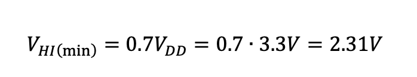

Thus, a signal of approximately 3.22 V provides a safety margin of over 0.9 V above the threshold, ensuring reliable logic level detection.

We assembled the circuit using jumper wires and heat shrink tubing for strain relief, then connected it between the Arduino’s A3 output and the Pi’s GPIO input. Before making the final connection, we verified the output with a multimeter and confirmed a consistent 3.2 V reading from a 5 V input. Our first attempts to solder the resistors into place resulted in a 0 V reading at the output, so we abandoned soldering for this part and used tight mechanical connections instead, which restored the correct voltage. With the divider working as intended, the ground lines properly connected, and the firmware changes in place, the Arduino could now output a clean, correctly- eveled trigger signal to the Raspberry Pi whenever the sensor detected a droplet.

### **Testing and Integration of the Raspberry Pi Trigger Input**

After assembling the voltage divider, our next step was to connect it to the Raspberry Pi. Before doing so, we wanted to confirm that the Pi’s GPIO pins, specifically GPIO 17, were functioning correctly. To verify this, we wrote a short Python script named test_input.py. The script used the RPi.GPIO library, which we installed via:

sudo apt-get install python3-rpi.gpio

We connected a female–male jumper wire to GPIO 17, ran the script with:

python3 ./test_input.py

and then briefly touched the male side of the jumper to the Pi’s 3V3 pin. The script successfully detected the voltage change, confirming that the pin was operational.

With GPIO functionality verified, we connected the voltage divider output from the Arduino to the Raspberry Pi’s GPIO 17. To ensure the Pi could detect signals from the Arduino, we created another small test script called test_signal.py. This script monitored GPIO 17 for a HIGH state and printed a message when detected. Running the prototype confirmed that when the Arduino detected a droplet, the Pi also registered the event.

  

While the polling approach in test_signal.py worked, we recognized its limitations: it continuously checks the pin state, which is inefficient and risks missing very short pulses if the loop runs too slowly. To improve responsiveness, we implemented edge detection using the RPi.GPIO event system. This method triggers the callback immediately when GPIO 17 transitions from LOW to HIGH (rising edge), allowing the Pi to respond the moment a droplet is detected. The new script, edge_detect_signal.py, was tested and worked reliably.

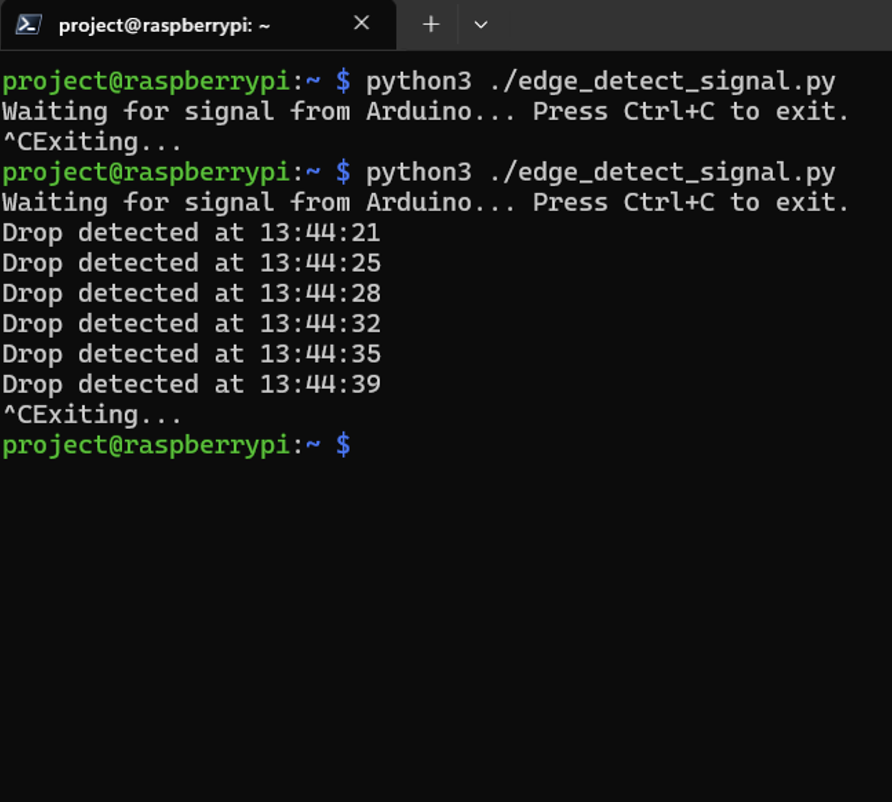
The final step was to integrate video capture. We developed one_drop_trigger_capture.py, which initiates high-speed recording as soon as the first drop is detected. Upon detection, the script executes the camera capture commands and then stops further detection to ensure only a single event is recorded per run, though this logic can be expanded later to capture multiple drops.

Beginning of the capture after drop is detected:

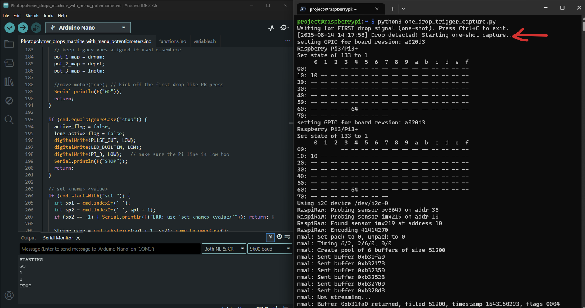

End of capture run:

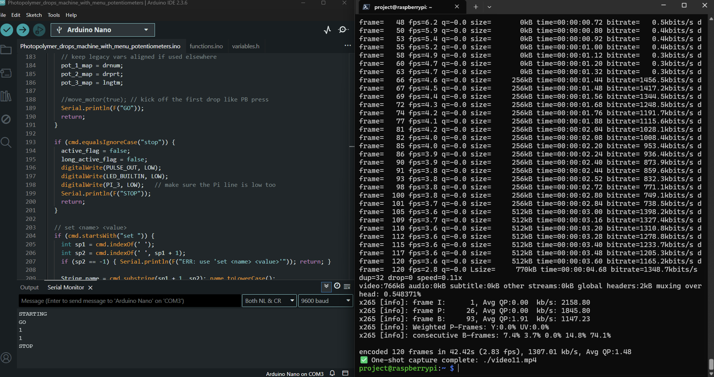

With this pipeline in place, the system can now detect a droplet via the Arduino, transmit a safely level shifted trigger to the Raspberry Pi, and initiate synchronized high speed video capture within milliseconds of detection.

## **Integrating UV Illumination into the Prototype**

Up to this point, our work with the prototype has focused on bringing the mechanical, electronic, and sensing subsystems into full synchronization. We established reliable droplet dispensing, verified detection through the optical sensor, and ensured that the Arduino could communicate trigger signals directly to the Raspberry Pi for video capture. These steps allowed us to reproduce the sequence of events of the final exhibit in a controlled, testable setup.

Until now, however, we had deliberately left the UV LED array disconnected. The reason was simple: integrating the curing light introduced additional complexity, both in wiring and in timing control, and it was not essential during the early stages when our priority was to validate motor motion, droplet detection, and communication with the Pi. Just as importantly, the UV subsystem operates at 48 V, which makes it far more dangerous to handle compared to the low voltage electronics we had been working with up to this point. Since we ran the prototype many times in the course of testing and troubleshooting, we wanted to avoid any unnecessary risk of damaging components or creating unsafe operating conditions. For these reasons, we chose to postpone activating the UV array until the rest of the system was proven stable.

With those foundations now in place, and with the prototype functioning reliably in repeated runs, the time has come to safely integrate and synchronize the UV system as well.

This step is important because our current experiments aim to replicate the original exhibit’s operating conditions as closely as possible. The high speed camera will ultimately need to perform under those same conditions, and without the UV lighting the visual characteristics of the droplets in motion cannot be fully representative. By bringing the UV subsystem online and aligning its activation with the droplet detection events, we can ensure that the prototype now behaves as a faithful miniature of the final installation, providing us with realistic test data for refining our camera capture methods.

To understand how the UV illumination is implemented in hardware, we examined the dedicated PCB and schematic for the curing light module. The system is powered by a 48 V supply, which enters through the DC input connector and is routed directly to the positive side of the LED array. In fact, the high rail is always present on the LEDs they are permanently tied to the 48 V line through wide copper traces designed to handle the high current drawn by six high power diodes rated at 5–10 W each. The true switching element lies on the ground side of the circuit, where current return is either allowed or blocked.

Control is achieved using a power MOSFET, which is placed between the LED cathodes and ground. When the Arduino provides a gate drive signal, the MOSFET turns on and completes the current path, allowing the LEDs to illuminate. When the gate is low, the MOSFET isolates the LEDs from ground, so even though the anodes sit at 48 V, no current can flow. This so called low side switching architecture is both efficient and practical, as it avoids the need to break the high voltage rail directly. Supporting resistors on the gate path help ensure stable switching, while a secondary indicator LED provides a simple visual cue when the system is active.

On the PCB layout, the high power rails are clearly distinguished: the positive supply is highlighted in red, the ground return in blue. Their trace widths are intentionally large to handle sustained current without overheating. The connectors labeled CON_P and CON_N distribute the positive and negative rails to the LED strings, while the MOSFET is positioned close to the load to minimize parasitic effects.

This arrangement means the LEDs are effectively always connected to high, but they only light when the MOSFET pulls them down to ground under explicit logic control. That design makes the UV array safe to integrate into the broader system, since activation cannot occur unless the Arduino deliberately drives the gate. With this circuitry in place, our next task is to synchronize the UV flashes with droplet detection and camera capture, creating test conditions identical to the final exhibit and enabling us to refine our imaging under realistic illumination.

   *Schematic, UV Curing Light*  
     

   *PCB Layout, UV Curing Light*  
     

After reviewing the schematic and PCB layout, the next step was to bring the curing light hardware into operation. To do this, we first soldered connectors both onto the dedicated UV PCB and onto the prototype’s main PCB, ensuring that the two boards could be linked securely using jumper wires. This modular approach gave us the flexibility to test the curing system step by step before committing to full integration with the entire LED array.

For the first trial, we connected the UV PCB not to the full exhibit lighting assembly but to a single high-power LED. Our intention was to validate the electrical connections and confirm that the MOSFET switching stage behaved as expected under load. With the board connected to a regulated 48 V power supply, the LED illuminated exactly as designed when the MOSFET gate was driven, demonstrating that the circuit was functional and that the soldered connections were stable. This staged approach allowed us to test safely and verify the design at minimal risk.

Once this initial validation succeeded, we disconnected the test LED and instead wired the UV PCB directly to the LED rows mounted on the prototype. With the same 48 V supply applied, the larger LED assembly activated correctly, confirming that the power distribution, MOSFET control, and wiring harness all operated reliably at scale. This successful test meant the UV subsystem could now be considered fully integrated.

## **Camera Synchronization Experiments**

The goal of this stage was to verify that the camera was functioning properly and to determine its exact positioning so that we could improve image quality. To achieve this, we performed a series of experiments.

### **First Attempt**

In the first attempt, the resulting video contained only a black screen, showing no evidence of the droplet or the UV flash. Our first thought was that perhaps the system itself was working, but the camera was not properly aligned and therefore failed to record the event. To test this possibility, we tried moving the camera as close as possible to the droplet path, hoping that proximity would reveal at least a faint signal. We also increased the frame height from 64 to 320 pixels. Since a frame height of 64 is quite narrow, expanding to 320 gave us a much wider field of view and a greater chance of capturing something in the frame.

We recall that the camera is mounted at a 90-degree rotation, since the rolling shutter sensor reads line by line and for our application the vertical axis of the falling droplets is more critical than the horizontal dimension. By reducing the number of lines we effectively compress the axis and can capture the motion more efficiently. In this first attempt, however, even with the adjustments to resolution and positioning, no usable video was produced.

To check whether the issue was related to the camera or to the Raspberry Pi itself, we performed a control test. Instead of relying on the sensor triggered script, we started the camera manually, at the exact moment we knew a droplet would fall, and recorded for a longer duration than usual to make sure the drop would be captured somewhere in the sequence. When we later reviewed the footage, we could clearly see the event. This confirmed that both the Raspberry Pi and the camera were functioning properly, and that the issue was not due to misalignment or faulty hardware. The real problem lay in the synchronization between the Arduino trigger and the Raspberry Pi capture script.

**[First successful attempt](https://drive.google.com/file/d/1Ykk5Uip4b63IA97jSYBqBQ3OBTui59Sb/view?usp=drive_link)**

### **Second Attempt**

After several failed attempts, we eventually realized the issue. In our capture routine we had accidentally left in an I2C status check that was originally needed only once during initialization. Because it ran repeatedly inside the loop, it introduced an additional delay before the Pi started recording.

This delay was enough to completely throw off synchronization, by the time recording began, the droplet had already passed through the region of interest. Since we had configured the prototype to release a new drop only every three seconds, the recording window consistently ended before the next droplet appeared. In practice, this meant that we never managed to capture the critical moment, the maximum footage we obtained was about one second with nothing useful in frame.

Once we identified the mistake, we cleaned up the script by removing the repeated I2C check from the loop and also eliminated an extra delay that had been left in the Arduino code. With these corrections, synchronization immediately improved. For the first time, we produced a video that actually showed the droplet event at the correct moment, even though further fine tuning would still be needed.

**[Second attempt](https://drive.google.com/file/d/1nz-HmmVeMYbKkoLe5iBu_BNrmOuvZssi/view?usp=drive_link)**

### **Third Attempt**

In the third trial we shifted focus to camera placement. We reduced the frame height (number of rows) to capture and experimented with camera positioning relative to the droplet path. This confirmed that the synchronization was working, but revealed that the camera alignment was incorrect, since droplets did not consistently appear within the frame.

**[Third Attempt](https://drive.google.com/file/d/1fHyBt6_lvj7hkRYKEYBgoefq1-nEfLwA/view?usp=drive_link)**

### **Ongoing Trials**

After a series of trial and error experiments, we eventually identified a camera placement that consistently captured the droplets and provides a reliable basis for improving image quality going forward.

**[Final positioning attempt](https://drive.google.com/file/d/1xlmjmXJPGok_TyZNuMyr5RXJRBlFVw0r/view?usp=drive_link)**

The position is as follows:

- 8 cm away from the opening

- Lens center 0.5 cm from the right edge of the opening

- 2 cm above the bottom of the opening


Although our earlier trials brought us close to a workable position, we later realized that the chosen spot was not viable for the actual exhibit. The installation, as shown in the image below, includes a yellow protective shield positioned in front of the droplet path. This barrier is designed to protect visitors from the strong UV, but it also makes it impossible to capture high quality footage through the shield. Any attempt to film through it would significantly degrade image clarity and distort the results.

   *Exhibit with yellow UV protection shield*  
   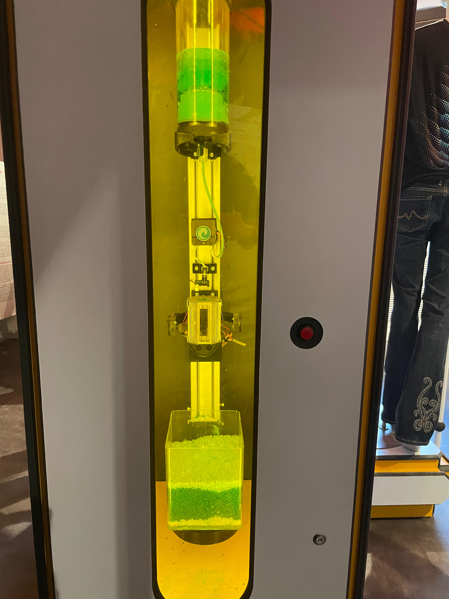  

Because of this, we decided to relocate the camera behind the installation, bypassing the shield entirely. This new placement allows us to observe the droplet path directly, without the optical interference caused by the protective layer. On the prototype, we mounted the Raspberry Pi camera on the rear frame and secured the supporting electronics alongside it, as shown in the image below. The purpose of this setup is to evaluate whether the new perspective provides sufficient clarity.

However, this rear placement introduces a new challenge, the camera is now much closer to the droplet column than before. As a result, we will need to reconfigure its settings such as focal length, frame height, and exposure parameters to adapt to the reduced distance. At the same time, we decided to keep the previous distance measurements documented, so that if needed we can reconfigure the camera back to its earlier position.

   *Prototype with camera repositioned behind the droplet column*  
   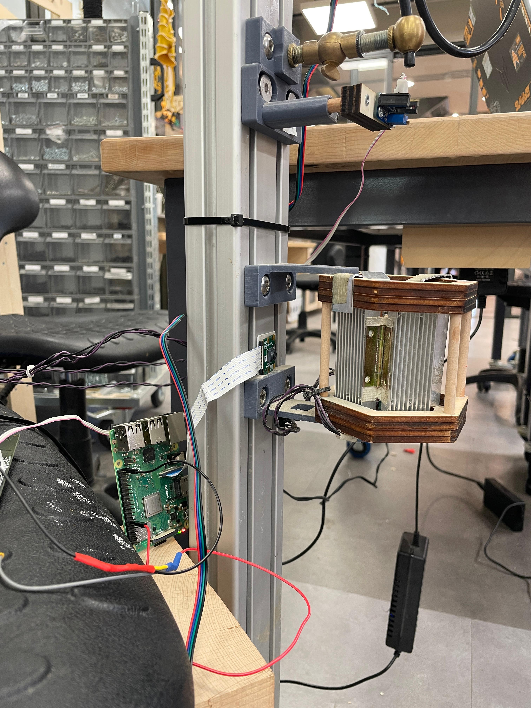  


### Lens Adjustment
Because the stock V2 module has a fixed focus lens optimized for 60 cm to infinity, we attempted manual focus adjustment by rotating the glued lens. This eventually damaged the lens. Since the museum did not have a spare V2 module, we replaced the lens with one from another camera module temporarily. In the future, we plan to switch to an IMX219 module with an **M12 mount** lens, which will allow attaching dedicated zoom/focus lenses.

### Improving Contrast
Another issue was poor contrast, UV illumination is blue while the droplets were colored with green dye, which provided limited visibility. We replaced the dyed water with a fluorescent additive. Under UV light, the droplets now appear bright and glowing, improving their visibility in high speed recordings.

### Video Archive
The following folder contains the **initial camera experiments**,  
recorded before the lens was scratched and before the replacement of the green dye with fluorescent material:  

[Initial Camera Tests](https://drive.google.com/drive/u/1/folders/1z9lNiULwwIG49Ctze9CZizduTPMhc4pU)


To correct our focusing workflow, we switched from Raspberry Pi OS Lite to the standard Raspberry Pi OS to enable a live preview. With the preview active, we placed a high-contrast ruler at the working distance and manually rotated the IMX219 lens until we reached maximum sharpness. Any further movement in either direction immediately reduced focus, confirming the peak.
The lens is now calibrated for a working distance of 7.3 cm.

*Ruler used to calibrate the IMX219 lens at 7.3 cm working distance*  
  

*Focused view of the dispensing nozzle at 7.3 cm after lens calibration*  


The reason this adjustment is necessary is rooted in the imaging condition of a thin lens. The relation

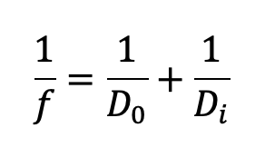

states that for a given focal length f, an object at distance D_0, will only form a sharp image if the sensor is positioned at the corresponding image distance D_i, By rotating the IMX219 lens, we are effectively changing the spacing between the lens and the sensor. At the correct position, the rays from each point in the object converge precisely on the sensor pixels, producing maximum sharpness and contrast. If the lens is rotated slightly in or out, the convergence plane shifts before or after the sensor, and the image becomes blurred. At our chosen working distance of 7.3 cm, the adjustment aligns the optical geometry exactly, ensuring accurate focusing.

### Focus Improvement

To demonstrate the impact of proper focus calibration, we created a comparison video that combines two recordings into a single stacked frame:

Top section – Droplet capture recorded before lens focus adjustment.

Bottom section – Droplet capture recorded after calibrating the IMX219 lens.


[Focus comparison](https://drive.google.com/file/d/1X2-TqklAu1A6jz3skCsFLxwyzy4B9QhM/view?usp=drive_link)

The difference is clear, in the bottom section, the droplet edges are sharper, contrast is higher, and fine details are more visible. This confirms that accurate optical focusing significantly improves image quality and should be performed prior to sensor-level register tuning.

### Exposure and Gain Adjustment

After calibrating the lens focus, we moved on to adjusting the sensor parameters to further improve image clarity during high speed capture. The two most important settings for this stage are gain and exposure time, as both directly affect brightness, sharpness, and the quality of the captured droplet motion.

Gain refers to the amplification of the signal coming from the sensor’s pixels. Increasing the gain makes the image appear brighter without changing the exposure time, but this comes at the cost of amplifying noise as well, which reduces the overall signal to noise ratio. For our system this trade off is not desirable, because the UV illumination during the polymerization reaction is already strong enough to provide sufficient brightness. To preserve the cleanest possible image, we fixed the gain at a value of 1× in all tests, ensuring that no unnecessary noise was introduced into the recordings.

Exposure time, or shutter time, defines how long each row of the rolling shutter sensor is exposed to light before being read out. In the raspiraw tool this parameter is controlled with the -eus flag and is set in microseconds. A longer exposure gathers more light and results in a brighter image, but it also reduces the maximum achievable frame rate and introduces motion blur, which is particularly problematic when recording droplets that fall and polymerize within only a few milliseconds. Exposure time must also remain shorter than the total frame duration, otherwise the sensor cannot complete the readout in time, which limits how far the value can be increased. Conversely, very short exposures minimize blur and preserve the high temporal resolution we need, but they require strong illumination to avoid underexposure.

To evaluate the effect of exposure time under our fixed gain of 1, we recorded a series of tests at default exposure (set to -1), 50, 100, 200, 500, and 800 microseconds. In this context, setting -eus -1 instructs the driver to use the sensor’s default automatic exposure, letting the system determine the integration time internally. These six recordings were combined into a single stacked comparison video for direct evaluation.


[Stacked exposure comparison, from top to bottom: default (-1), 50 us, 100 us, 200 us, 500 us, 800 us](https://drive.google.com/file/d/1cCWQ9jaKp1_bPCUkb_xt1R3oLjgblMFd/view?usp=drive_link)

The results show a clear trend. At 50 us the droplets are sharp and well defined, with minimal motion blur, although the overall brightness is lower.

From these results we conclude that the optimal setting at this stage is 50 us with gain fixed at 1. This configuration provides the best balance between brightness and sharpness, enabling us to clearly capture the droplet motion without excessive blur, and establishing a strong baseline for further tuning of the camera registers and overall capture pipeline.

After identifying 50 us as the best compromise between brightness and sharpness, we performed an additional series of tests at even shorter exposures of 1, 5, 10, 25, 50, and 60 us in order to evaluate whether reducing the exposure further would provide additional benefits.

The comparison video below shows that the differences across these extremely short exposures are minimal. Motion blur was already well controlled at 50 us, and reducing the exposure to values as low as 1 us did not noticeably improve image sharpness or contrast. Based on these results, we concluded that 50 us remains a suitable baseline and that further reductions in exposure are unnecessary for our current illumination conditions.


[short exposure comparison, from top to bottom: 1 us, 5 us, 10 us, 25 us, 50 us, 60 us](https://drive.google.com/file/d/1J8HzZhqTxJV4cv6MzSbxZyY9jCHJqMZH/view?usp=drive_link)

Having reached this point, we decided it was time to transition from water based testing to the actual material used in the exhibit. To improve contrast and visibility under UV illumination, we plan to mix a fluorescent additive into the photopolymer. This will cause the droplets to appear bright and glowing when exposed to UV light, significantly enhancing the contrast and overall image quality in the high speed recordings.

## Fluorescent Additive and Exposure Adjustment ##

After completing the water based tests, we transitioned to the actual photopolymer used in the exhibit. To enhance visibility under UV illumination, we mixed a small amount of fluorescent powder into the polymer. A preliminary check under external UV light confirmed two important points:
The material indeed emitted a strong glow, providing higher contrast compared to water, The additive did not interfere with the polymerization process, the droplet still cured correctly under UV.

Once confirmed, we replaced the water with the fluorescent polymer and began high speed capture tests using the same baseline settings established earlier (50 us exposure, gain fixed at 1). However, the recordings at 50 us were too dark under these new conditions. To compensate, we increased the exposure time step by step, testing 500 us and finally 1000 us. The best results were obtained at 1000 us, which is the maximum allowed by the sensor timing constraints.

The reason 1000 us is the upper limit is that exposure time must remain shorter than the total frame duration. In rolling shutter sensors, each row must be exposed and then read out sequentially. If the exposure is set longer than the time it takes to scan the entire frame, the sensor cannot complete the readout, leading to image corruption or dropped frames. In our configuration, 1000 us represents the longest valid integration time that still allows full frame readout at the desired frame rate.

The following recordings demonstrate the progression:


[First attempt with 50 us exposure on polymer droplets](https://drive.google.com/file/d/1VXqXNtUjAdg2IJR1tUk5zI5pbu2uNVJz/view?usp=drive_link)


[Comparison of three exposure settings (50 us, 500 us, and 1000 us), stacked vertically](https://drive.google.com/file/d/18h_Qybyh7JIyYHXmYGO3AuyPu7R205_c/view?usp=drive_link)

This stacked recording directly compares three exposure values: 50 us at the top, 500 us in the middle, and 1000 us at the bottom. The progression clearly shows how increasing the exposure time improves brightness and visibility of the fluorescent polymer droplets. While 50 us maintains high temporal resolution, the image is too dark. At 500 us the droplets become brighter but still lack optimal contrast. At 1000 us, the maximum valid exposure for our configuration, the droplets are clearly visible with glowing edges and well defined contours, confirming this as the best setting for our illumination conditions.

## Sensor Calibration Workflow ##

After optimizing focus and exposure, we moved on to tuning the low level sensor parameters in order to improve image fidelity. The first step was to create a lightweight script to display individual frames rather than full video sequences, which allowed us to evaluate raw sensor output frame by frame.

We then developed a calibration script capable of extracting sensor statistics such as white balance, saturation, and black level. A wrapper script (run_calibrate_range.sh) automated this process across large ranges of raw frames, producing structured JSON reports for each capture. This enabled us to build a statistical picture of the sensor’s baseline behavior.

To determine the black level offset, we covered the camera lens completely and captured a set of dark frames. Processing these frames with sensor_calibrate_imx219_.py yielded a consistent black level estimate of 63 DN across all channels. We fixed this value in all subsequent conversions (dcraw -k 63) to ensure that no negative values or artificial offsets would affect image linearity.

For white balance, we ran the analyze_sensor_json.py tool on a large batch of previously generated JSON reports. Each JSON file already contained per frame statistics exported from the raw sensor data. The script aggregated these existing values by averaging across the red, green, and blue planes. The resulting multipliers were consolidated into a CSV file and confirmed by visual inspection. We then adopted the following calibration values in the dcraw conversion stage:

-r 1.048 0.996 1.005 0.650

These coefficients ensured that all color channels were balanced relative to green, correcting for the IMX219’s native spectral sensitivity.

For saturation (dcraw -S), we swept a range of input values and determined that the sensor saturates close to its full 10-bit scale. Visual inspection of highlight clipping showed that the most stable results were obtained with the maximum allowed value, 1023 DN, which we therefore fixed for all subsequent processing.

*Representative Frames After Calibration*  

  

  

  

## Camera Relocation and Lens Upgrade ##

After obtaining the initial recordings, we reviewed the results with our project supervisor. The feedback was that the image quality was already sufficient for the exhibit: the droplets were clearly visible, well separated, and free from motion smearing or aliasing. However, due to the limited field of view of the stock lens, the droplet appeared partially cropped in the frame.

To mitigate this effect, we repositioned the camera farther from the dispensing nozzle, increasing the working distance from 7.3 cm to 32 cm. At this new distance, we performed a fresh lens focus adjustment to match the updated geometry, ensuring that the sensor plane aligned precisely with the converging rays from the lens. Once refocused, the droplets were again sharply resolved.

This wider perspective allowed the full droplet trajectory to be captured in a single frame while maintaining high sharpness and contrast. The recording confirmed that moving the camera back effectively solved the cropping issue. Looking ahead, we ordered the same IMX219 sensor with an M12 lens holder, which will enable us to swap lenses freely and optimize the captures.

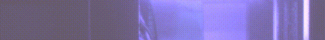

[High speed recording of droplet motion at 32 cm working distance](https://drive.google.com/file/d/1fGTXfQZj-48s78iyI7dZXUsySlFIUiiA/view?usp=drive_link)

## Sharpening Filter in Video Encoding ##

After assembling the video from the raw frames using the ffmpeg_timestamp.txt file, generated during the frame capture and calibration process, we explored additional processing steps to improve clarity. At this stage we introduced sharpening during the encoding phase using the unsharp filter in FFmpeg. This filter, expressed in the form unsharp=lx:ly:la:cx:cy:ca, provides control over both brightness and color sharpening. The kernel sizes determine how widely the effect spreads, while the strength parameters adjust its intensity. Stronger values enhance detail but risk introducing halo artifacts, while more subtle settings preserve a natural appearance.

Through iterative testing we determined that the configuration unsharp=5:5:1.5:5:5:0.0 offered the best balance, producing sharper edges and clearer details without visible artifacts. The effect was validated by comparing the result to the earlier file second_good.mp4, and the optimized version was saved as sharpen_encoding.mp4. The comparison video below highlights the difference, with the lower half representing the sharpened encoding and appearing noticeably crisper than the original.


[High-speed recording with sharpening applied](https://drive.google.com/file/d/1zB-2D83GyI8HG_rnekBO-HSA1uAQh32y/view?usp=drive_link)

## System Setup and Environment Management ##

In order to run the high speed capture system reliably, the Raspberry Pi had to be configured both at the operating system level and at the software environment level. The starting point was the official 2019-07-10 Raspbian Buster Full image. After flashing the SD card and booting the system, we applied several changes to the configuration files to enable proper camera support. Specifically, the file ~/boot/config.txt was edited to include the following lines:

start_x=1
dtparam=i2c_vc=on

The first command enables the camera firmware interface, while the second activates the I2C bus on the video core, which is required for direct communication with the sensor. To support high bandwidth video capture, we also increased the GPU memory allocation to 256 MB, ensuring that enough buffer space was available for image frames.

Once the base configuration was complete, we updated the package manager with:

sudo apt update

and proceeded to build the forked repository that contained the necessary capture tools. During compilation, several dependencies were missing and had to be installed manually. In particular, building dcraw required the following development libraries:

sudo apt install libjpeg-dev liblcms2-dev libjasper-dev

These libraries provide support for JPEG decoding, color management, and additional image formats that are essential for converting the raw sensor data into usable images.

Because the project integrates multiple Python programs for different tasks (calibration, frame extraction, analysis, and encoding), we adopted a structured approach to dependency management. Rather than installing all packages globally, which often leads to version conflicts, each program is placed in its own dedicated directory with a virtual environment. This guarantees that the libraries required for one program do not interfere with those of another.

The workflow for managing these environments is straightforward. After creating the environment with

python3 -m venv .venv

we activate it before running any Python scripts using:

source .venv/bin/activate

Once activated, all installed libraries are isolated within that environment. Exiting is done simply with:

deactivate

This structure has proven essential for a project of this scale, where multiple scripts are developed and tested in parallel. By isolating the dependencies for each component, we avoided conflicts and maintained reproducibility across the entire workflow.

## Interactive Playback UI ##

The next step was to design an interactive playback interface. The goal was to provide the museum visitors with a way to directly control the viewing experience: pausing the droplet, rewinding it, or jumping back to key moments. Achieving this required a combination of software design and physical hardware integration with the Raspberry Pi.

The playback system was implemented using OpenCV, an open-source computer vision and image processing library. Other playback options available on Raspbian Buster, such as OMXPlayer, VLC, or mpv, were considered, but each had significant drawbacks. OMXPlayer and mpv relied on legacy hardware acceleration and offered little flexibility beyond simple playback. VLC provided more filters but demanded higher CPU usage and was less stable on Buster. In fact, when we initially attempted to use VLC, it introduced system-level issues that we could not resolve and ultimately forced us to reinstall the entire operating system.

OpenCV resolved these issues by offering a single, well optimized framework entirely within Python. With OpenCV we were able to load raw TIFF frames, perform preprocessing steps such as bit depth conversion, rotation, and letterboxing, and later extend the system with advanced motion interpolation. This combination of efficiency, flexibility, and direct integration into our Python workflow made OpenCV the most practical and scalable choice for building an interactive, high speed playback interface on the Raspberry Pi.

### Stage 1: Keyboard based Player ###

The first implementation relied entirely on the keyboard. This approach provided a quick way to validate the playback logic before committing to hardware. The player script performed several preprocessing steps before any playback was shown on the screen. All raw TIFF frames were loaded from the capture directory. Since the sensor generated 16 bit grayscale frames, the images were converted to 8 bit format to match display hardware limitations. Each frame was rotated by 270 deg so that the droplet appeared in the correct orientation on the HDMI monitor. Letterboxing was applied to preserve the sensor’s original aspect ratio and prevent distortion.

Timing was handled with precision: the loop targeted 60 frames per second, corresponding to the monitor refresh rate. The code calculated the frame period in seconds (1/60) and compared it with the actual elapsed time using time.perf_counter(). If the playback loop drifted behind schedule, the program applied a correction to maintain synchronization. To avoid boundary conditions, frame indices were managed in a cyclic manner: once the last frame was reached, the index wrapped back to the beginning (or in reverse, wrapped to the end). This made it possible to continuously loop the experiment in both directions without special handling at the edges.

Keyboard mappings provided full playback control. The space bar toggled between play and pause, R reversed direction, A and D allowed stepping backward or forward by one frame (while forcing pause), J and K jumped five frames in the respective directions, S reset the sequence to the first frame, F toggled fullscreen, and Esc/Q terminated the program. This implementation, found in the script player_tiff_keyboard.py, created a responsive baseline and allowed us to quickly test the feel of playback.

### Stage 2: Interpolation for Smoother Playback ###

Even with correct timing, direct playback of the raw ~100 captured frames at 60 fps appeared visually discontinuous. The droplet seemed to jump slightly between frames, breaking the illusion of continuous motion. To mitigate this, we introduced frame interpolation using Farnebäck optical flow.

This algorithm estimated pixel wise motion between consecutive frames. A coordinate grid was generated (np.meshgrid), and each frame was warped toward the other based on its optical flow field. For an intermediate frame positioned at time fraction a between frames A and B, both A and B were warped proportionally (a and 1–a), and the two warped images were blended. The result was a synthetic frame that smoothly bridged the motion gap.

We tested several interpolation factors: 2, 4, 5, 6, and 8. Each factor represented how many steps were inserted between two original frames. For example, a factor of 4 turned every pair of consecutive frames into four steps: the first original, two interpolated frames, and the second original. Factors smaller than 4 left visible discontinuities, while larger factors artificially slowed down the droplet’s fall because the display remained fixed at 60 fps. After extensive trials, factor 4 was selected as the best compromise: motion appeared smooth without distorting the perceived timescale of the droplet. Precomputing the interpolated sequence ensured that playback at 60 fps remained consistent, without adding real time processing delays. This functionality was implemented in player_tiff_keyboard_interp.py.

### Stage 3: Hardware Interface with Push Buttons ###

Once the playback logic was validated in software, we moved on to physical interaction. For a public exhibit, relying on a keyboard was clearly impractical. At this stage we considered two possible interface options: a touchscreen display implemented with a Python GUI (for example using Tkinter), or a set of physical push buttons wired directly to the Raspberry Pi. Although a touchscreen could have provided a flexible graphical interface, it was ultimately rejected because the installation is designed for children. Continuous handling would quickly smudge or damage the screen and reduce its durability. Physical buttons, on the other hand, are robust, easy to clean, and provide a clear tactile response that is better suited for interactive use in a museum setting.

We therefore selected push button switches with integrated microswitches. Each unit consists of a large, durable button on the front and a microswitch block with three metal tabs for electrical connections. The terminals are labeled COM (common), NO (normally open), and NC (normally closed). We chose COM + NO, which is open when idle and closes only when pressed. This configuration is intuitive: the circuit is “off” until a visitor presses the button.

The wiring followed an active low logic: the COM terminal was connected to ground, the NO terminal to a GPIO input pin, and the Pi’s internal pull up resistor was enabled in software. As a result, the pin reads HIGH by default and transitions to LOW when the button is pressed. The Raspberry Pi has multiple equivalent ground pins, so for convenience each button’s COM was wired to a nearby GND according to the pin layout. A dedicated test script (button_test.py) confirmed correct wiring by continuously reading the GPIO input and printing “Pressed” or “Released,” with a short debounce delay to account for mechanical switch bounce.

### Stage 4: Integrating Buttons into the Player ###

In the final implementation (player_pin.py), three buttons were mapped to playback functions: GPIO27 toggled play/pause, GPIO23 reversed direction, and GPIO24 performed a fixed jump forward or backward depending on the current playback direction. Each pin was configured with GPIO.PUD_UP and an event detection callback on the falling edge. To avoid false triggers from switch bounce, a debounce interval of 200 ms was applied.

The figure below shows the Raspberry Pi GPIO header, which served as a reference during development for identifying the correct pins and nearby GND connections.

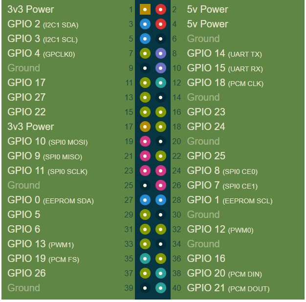  

The callback functions directly modified the playback state. Pressing the play button inverted the Boolean variable controlling playback. Pressing the reverse button multiplied the direction variable by –1. Pressing the jump button incremented or decremented the frame index by a constant JUMP_AMOUNT, depending on the current direction. Importantly, the jump button did not alter the play/pause state, which meant that playback could continue seamlessly if already running. This preserved consistency with the earlier keyboard interface and ensured a smooth user experience.

### Results and Validation ###

The combined system successfully merged software interpolation with hardware interaction. Visitors can now pause the droplet mid air, reverse its motion, or jump back and forth in controlled steps. 

Several technical details played an important role in reaching this point. By treating the frame index cyclically, the player avoided errors at the dataset boundaries and allowed continuous looping in both directions. Drift correction in the timing loop ensured that even when small delays accumulated, the display rhythm remained steady and consistent with the 60 fps target. The choice to precompute interpolated frames rather than generate them on the fly gave the droplet motion a smoother appearance while preserving the natural speed of the fall. On the hardware side, the decision to use active low wiring with the Pi’s internal pull ups simplified the circuitry and eliminated the need for extra components, while software based debouncing compensated for the mechanical bounce inherent in the push buttons.

Validation was carried out step by step. We began with the button_test.py script, confirming that each switch produced clean transitions between pressed and released states. Once verified, the same logic was connected to the keyboard based player to check functional equivalence. Finally, the complete system—with interpolated frames, precise timing, and GPIO callbacks was tested as a whole. In every stage the behavior remained responsive, predictable, and aligned with the interactive experience we had envisioned for the exhibit.

## Next Steps

??


